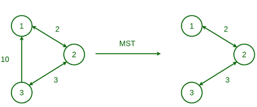

**Minimum Spanning Tree (MST)**

# Bài toán
Cho 1 graph bất kỳ có N nodes và V cạnh, tìm đường đi ngắn nhất (minimun cost) đi qua tất cả các nodes ⇒ đường đi ngắn nhất có số cạnh bằng số nodes - 1
# Ví dụ
